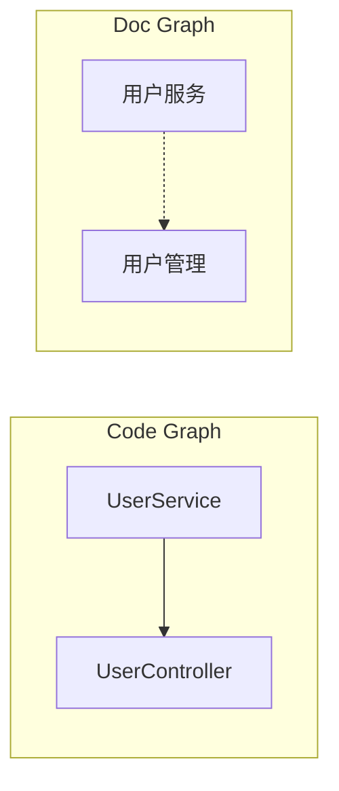

# Code-Doc Consistency Plugin — 使用指南

## 快速开始

### 1. 安装插件

将插件目录复制到你的 Claude Code 插件目录：

```bash
# Windows
xcopy /E /I code-doc-consistency-plugin %USERPROFILE%\.claude\plugins\code-doc-consistency

# macOS/Linux
cp -r code-doc-consistency-plugin ~/.claude/plugins/code-doc-consistency
```

### 2. 配置项目

在项目根目录创建 `.cdc-config.json`：

```json
{
  "code": {
    "languages": ["java"],
    "frameworks": ["spring-boot", "mybatis"],
    "rootPackages": ["com.example"]
  },
  "docs": {
    "paths": ["docs/", "README.md", "ARCHITECTURE.md"],
    "formats": ["markdown"]
  },
  "options": {
    "maxBatchSize": 15,
    "symbolIndex": true,
    "incrementalUpdates": true,
    "modelTier": "standard"
  }
}
```

### 3. 运行检测

在 Claude Code 中使用 `/cdc` 命令：

```
/cdc                    # 完整检测
/cdc --incremental      # 增量检测（仅分析变更文件）
/cdc --format=mermaid   # 输出 Mermaid 图表
```

---

## 核心概念

### 工作区结构

```
$PROJECT_ROOT/
├── _workspace/                    # 管道产物目录
│   ├── 01_code_scan.json         # 代码扫描结果
│   ├── 01_code_imp_out.json      # Import 解析结果
│   ├── 01_code_batches.json      # 代码批次划分
│   ├── symbol_index.json         # 全局符号索引
│   ├── 01_code_assembled.json    # 代码图（合并后）
│   ├── 02_doc_assembled.json     # 文档图（合并后）
│   ├── 03_alignment.json         # 节点对齐结果
│   ├── 04_validation.json        # 图谱校验报告
│   ├── 05_diff.json              # 一致性差异报告
│   ├── stats.json                # 管道统计
│   └── report.md                 # Markdown 报告
└── .cdc-config.json              # 项目配置
```

### 管道阶段

```
Phase A: SCAN          → 文件枚举 + Import 解析
Phase B: BATCH         → 语义化分批（便于并行处理）
Phase C: ANALYZE       → LLM 语义合成（每批独立处理）
Phase D: MERGE         → 批次图合并 + 去重
Phase E: REVIEW        → Schema 校验 + 质量检查
Phase F: ALIGN         → 跨图节点对齐
Phase G: DIFF          → 四层差异分析
Phase H: REPORT        → 报告生成
```

---

## 配置详解

### 代码配置

```json
{
  "code": {
    "languages": ["java"],           // 支持: java, typescript, python, go, rust, csharp
    "frameworks": ["spring-boot"],   // 支持: spring-boot, mybatis, quarkus
    "rootPackages": ["com.example"], // Java 根包名
    "exclude": [                     // 排除路径
      "**/test/**",
      "**/generated/**"
    ]
  }
}
```

### 文档配置

```json
{
  "docs": {
    "paths": ["docs/"],              // 文档目录
    "formats": ["markdown"],         // 支持: markdown, yaml, json
    "exclude": [
      "**/node_modules/**"
    ]
  }
}
```

### 管道选项

```json
{
  "options": {
    "maxBatchSize": 15,              // 每批最大文件数
    "symbolIndex": true,             // 启用全局符号索引
    "incrementalUpdates": true,      // 启用增量更新
    "modelTier": "standard",         // economy/standard/premium
    "concurrency": 4,                // 并行 worker 数量
    "cacheTTLLength": 3600           // 缓存 TTL（秒）
  }
}
```

### 对齐配置

```json
{
  "alignment": {
    "threshold": 0.6,                // Token 相似度阈值
    "aliases": {                     // 自定义别名映射
      "UserService": "用户服务",
      "UserController": "用户控制器"
    },
    "whitelist": [                   // 强制对齐的节点对
      { "code": "class:UserService", "doc": "concept:用户服务" }
    ]
  }
}
```

### 严重度配置

```json
{
  "severity": {
    "layerWeights": {
      "entity_existence": 1.0,
      "relationship_coverage": 0.8,
      "attribute_drift": 0.6,
      "behavior_divergence": 0.9
    },
    "nodeTypeRules": {
      "endpoint": { "multiplier": 1.5 },
      "security_filter": { "multiplier": 1.3 }
    },
    "ignorePatterns": ["test.*"]
  }
}
```

---

## 输出解读

### 差异报告结构

```json
{
  "layers": {
    "entity_existence": [           // 实体存在层：缺失/多余的节点
      {
        "type": "missing",          // missing/extra/conflict/drift
        "severity": "critical",     // critical/major/minor
        "codeNode": "class:PaymentService",
        "description": "代码中有 PaymentService，但文档未提及"
      }
    ],
    "relationship_coverage": [],    // 关系覆盖层
    "attribute_drift": [],          // 属性漂移层
    "behavior_divergence": []       // 行为差异层
  },
  "totalIssues": 5
}
```

### 严重度说明

| 级别 | 说明 | 示例 |
|------|------|------|
| **critical** | 必须修复 | API 端点缺失、安全配置不一致 |
| **major** | 建议修复 | 服务实现与文档不符、数据模型差异 |
| **minor** | 可选修复 | 命名风格不一致、注释差异 |

### 对齐结果

```json
{
  "matched": [                      // 已对齐的节点
    {
      "codeNodeId": "class:UserService",
      "docNodeId": "concept:用户服务",
      "confidence": "high",
      "align_confidence": 0.95
    }
  ],
  "code_only": [...],               // 仅代码侧有的节点
  "doc_only": [...]                 // 仅文档侧有的节点
}
```

---

## 高级用法

### 1. 增量检测

只分析自上次检测以来变更的文件：

```bash
/cdc --incremental
```

工作原理：
- 计算所有代码文件的 MD5 哈希
- 与缓存的哈希对比
- 只重新分析变更的批次
- 节省 60-80% 的检测时间

### 2. Mermaid 可视化

生成 Mermaid 格式的图表：

```bash
/cdc --format=mermaid
```

输出文件：
- `_workspace/report.md` — 包含 Mermaid 代码的 Markdown
- `_workspace/mermaid.json` — 结构化图表数据

在 Markdown 中渲染：



### 3. 自定义别名

当代码和文档使用不同名称时：

```json
{
  "alignment": {
    "aliases": {
      "UserRepo": "用户仓储",
      "UserService": "用户服务"
    }
  }
}
```

### 4. 强制对齐

手动指定应该对齐的节点：

```json
{
  "alignment": {
    "whitelist": [
      { "code": "class:UserService", "doc": "concept:用户服务" }
    ]
  }
}
```

### 5. 忽略特定检查

```json
{
  "severity": {
    "ignorePatterns": [
      "Generated.*",                 // 忽略生成的代码
      "test.*",                      // 忽略测试文件
      ".*_migration"                 // 忽略数据库迁移
    ]
  }
}
```

---

## 故障排除

### 常见问题

| 问题 | 解决方案 |
|------|----------|
| `scan-project` 找不到文件 | 检查 `.cdc-config.json` 中的 `code.exclude` 配置 |
| `extract-structure` 提取为空 | 确认文件语言在支持列表中 |
| 对齐结果为空 | 调低 `alignment.threshold` 或添加 `aliases` |
| 内存不足 | 减小 `maxBatchSize` 或启用 `incrementalUpdates` |

### 调试模式

```bash
/cdc --debug
```

输出详细的管道执行日志，包括：
- 每个阶段的耗时
- 每批处理的文件数
- LLM 调用的 token 消耗
- 缓存命中率

### 性能优化

1. **启用增量更新**：`"incrementalUpdates": true`
2. **调整批大小**：大项目用 `"maxBatchSize": 10`，小项目用 `20`
3. **使用经济模型**：`"modelTier": "economy"`（降低 LLM 成本）
4. **设置缓存 TTL**：`"cacheTTLLength": 7200`（2小时）

---

## 支持的语言和框架

### 代码语言

| 语言 | 支持程度 | 说明 |
|------|----------|------|
| Java | ★★★★★ | 完整支持，含 Spring/MyBatis |
| TypeScript | ★★★★☆ | 完整支持 |
| JavaScript | ★★★★☆ | 完整支持 |
| Python | ★★★★☆ | 完整支持 |
| Go | ★★★☆☆ | 基础支持 |
| Rust | ★★★☆☆ | 基础支持 |
| C# | ★★★☆☆ | 基础支持 |
| Kotlin | ★★★★☆ | 完整支持 |
| Ruby | ★★★☆☆ | 基础支持 |
| PHP | ★★★☆☆ | 基础支持 |
| C/C++ | ★★☆☆☆ | 有限支持 |

### 文档格式

| 格式 | 支持程度 |
|------|----------|
| Markdown | ★★★★★ |
| YAML | ★★★★☆ |
| JSON | ★★★★☆ |
| AsciiDoc | ★★★☆☆ |
| reStructuredText | ★★☆☆☆ |

---

## 示例配置

### Spring Boot 项目

```json
{
  "code": {
    "languages": ["java"],
    "frameworks": ["spring-boot", "mybatis"],
    "rootPackages": ["com.example"]
  },
  "docs": {
    "paths": ["docs/api/", "docs/architecture.md"]
  },
  "alignment": {
    "aliases": {
      "UserRepository": "用户数据访问",
      "UserService": "用户业务逻辑"
    }
  }
}
```

### 微服务项目

```json
{
  "code": {
    "languages": ["java", "typescript"],
    "exclude": ["**/proto/**", "**/grpc/**"]
  },
  "docs": {
    "paths": ["services/*/README.md", "docs/"]
  },
  "options": {
    "concurrency": 8,
    "maxBatchSize": 20
  }
}
```

### 文档优先项目

```json
{
  "code": {
    "languages": ["python"],
    "rootPackages": ["src"]
  },
  "docs": {
    "paths": ["docs/", "CONTRIBUTING.md", "ARCHITECTURE.md"]
  },
  "severity": {
    "layerWeights": {
      "entity_existence": 1.5,
      "attribute_drift": 1.0
    }
  }
}
```
